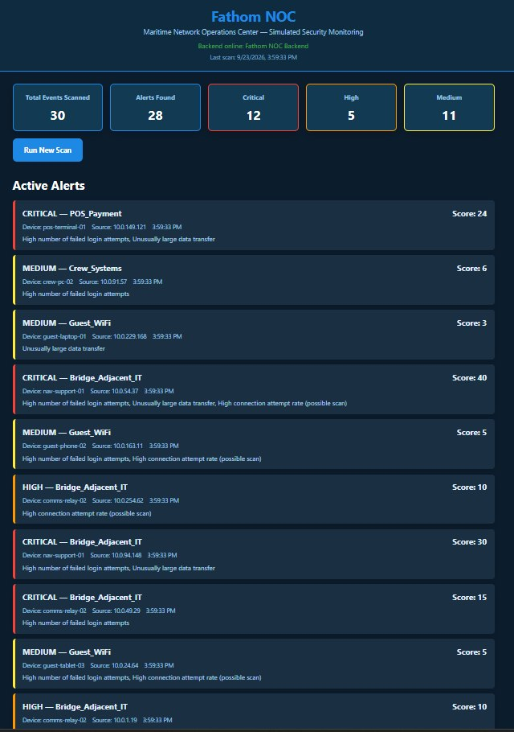

# Fathom NOC 🌊


A lightweight maritime Network Operations Center dashboard that simulates shipboard network activity and prioritizes suspicious events by rule-based detection and zone risk.

> **Demo note:** Fathom NOC uses simulated network traffic. It is an educational security-monitoring prototype, not a live intrusion-detection system.

## Live Demo

**[Open the deployed Fathom NOC Dashboard](https://fathom-noc-dashboard.onrender.com)**

## Dashboard Preview



The frontend is deployed as a Render Static Site and connects to the deployed Flask backend.

## Overview

Shipboard IT operates across multiple network zones with different levels of operational sensitivity. Fathom NOC models that environment with four zones:

- **Guest WiFi**
- **Crew Systems**
- **POS / Payment**
- **Bridge-Adjacent IT**

The dashboard runs a simulated scan, evaluates each event against detection rules, applies a zone-specific risk weight, and presents the resulting alerts as **Critical**, **High**, or **Medium**.

## Detection Logic

Each simulated event is checked for three suspicious patterns:

| Signal | Threshold | Score |
| --- | ---: | ---: |
| Failed login attempts | ≥ 5 | +3 |
| Data sent | > 300,000 bytes | +3 |
| Connection attempts | > 30 | +2 |

The rule score is then multiplied by the zone risk weight:

| Zone | Weight |
| --- | ---: |
| Guest WiFi | 1 |
| Crew Systems | 2 |
| POS / Payment | 4 |
| Bridge-Adjacent IT | 5 |

Final priority:

- **Critical:** score ≥ 15
- **High:** score ≥ 8
- **Medium:** score < 8

This makes the same suspicious behavior more significant when it occurs in a higher-risk zone.

## Architecture

```text
Simulated Traffic
       ↓
mock_data.py
       ↓
detection_rules.py
       ↓
Flask API
       ↓
Vanilla JS Dashboard
```

### API

- `GET /api/status` — backend health check
- `GET /api/events` — events from the latest scan
- `GET /api/alerts` — latest scan summary and alerts
- `POST /api/scan` — generate and evaluate a new simulated scan

Each scan evaluates one coherent batch of 30 events. The API also records when the scan was generated.

## Tech Stack

- **Backend:** Python, Flask, Flask-CORS
- **Frontend:** HTML, CSS, vanilla JavaScript
- **Testing:** Python `unittest`
- **Data:** simulated network events
- **Deployment:** Render
- **CI:** GitHub Actions

The frontend deliberately avoids a framework to keep the dashboard lightweight and easy to deploy.

## Project Structure

```text
fathom-noc/
├── backend/
│   ├── app.py
│   ├── detection_rules.py
│   ├── mock_data.py
│   ├── requirements.txt
│   └── test_detection_rules.py
├── frontend/
│   ├── index.html
│   ├── script.js
│   └── style.css
└── .github/
    └── workflows/
        └── tests.yml
```

## Run Locally

### 1. Start the backend

```bash
cd backend
pip install -r requirements.txt
python app.py
```

The Flask API starts on port 5000 by default.

### 2. Open the frontend

Open `frontend/index.html` in a browser. The dashboard is configured to use the deployed API by default; for local testing, set `window.FATHOM_API_BASE` to your local Flask URL before loading `script.js`.

### 3. Run the tests

```bash
cd backend
python -m unittest test_detection_rules.py
```

## What This Demonstrates

- Rule-based network anomaly detection
- Risk scoring based on network zone
- A lightweight REST API
- Frontend/backend integration
- Defensive handling of API failures
- Automated unit testing with GitHub Actions
- Deployment of a frontend and backend as separate services
- Clear separation between simulated data and a real production security system

## Limitations

This project intentionally uses simulated events and in-memory scan state. It does not inspect real ship traffic, persist historical scans, or replace a production IDS/SIEM. Those boundaries keep the prototype focused on the detection and prioritization workflow.

## License

See [LICENSE](LICENSE).
